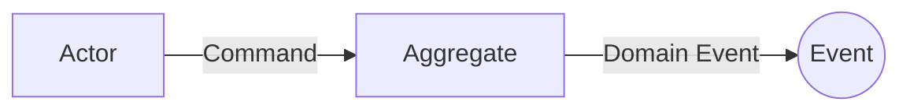

# Event Storming 輸出文件模板

## 目錄結構

```
ddd-docs/
├── event-storming/
│   ├── README.md
│   └── flows/
│       └── {flow-name}.md
```

---

## event-storming/README.md

```markdown
# Event Storming

## 已完成的業務流程

| 流程名稱 | 說明 | 連結 |
|----------|------|------|
| {流程名稱} | {簡述} | [查看](flows/{flow-slug}.md) |

## Hotspots 總覽

| 來源流程 | 問題 | 狀態 |
|----------|------|------|
| {流程} | {問題描述} | 待討論 |
```

---

## flows/{flow-name}.md

```markdown
# {流程名稱}

## 概述
{流程描述}

## 參與者 (Actors)
- {Actor 1}: {角色說明}

## 事件流程

### 主要流程



| 順序 | Actor | Command | Aggregate | Domain Event | 備註 |
|------|-------|---------|-----------|--------------|------|
| 1 | {Actor} | {Command} | {Aggregate} | {Event} | |
| 2 | Policy: {policy} | {Command} | {Aggregate} | {Event} | 自動觸發 |

### 分支流程: {分支名稱}

| 順序 | Actor | Command | Aggregate | Domain Event | 備註 |
|------|-------|---------|-----------|--------------|------|

## Policies (自動化規則)

| Policy 名稱 | 觸發事件 | 執行動作 |
|-------------|----------|----------|
| {Policy} | {When Event} | {Then Command} |

## External Systems

| 系統名稱 | 整合點 | 說明 |
|----------|--------|------|
| {System} | {在哪個步驟} | {做什麼} |

## Read Models

| 名稱 | 使用場景 | 資料來源 |
|------|----------|----------|
| {Read Model} | {何時需要} | {從哪些 Events 組成} |

## Hotspots

- [ ] {問題 1}
- [ ] {問題 2}

## Domain Events 清單

- {Event 1}
- {Event 2}
```
